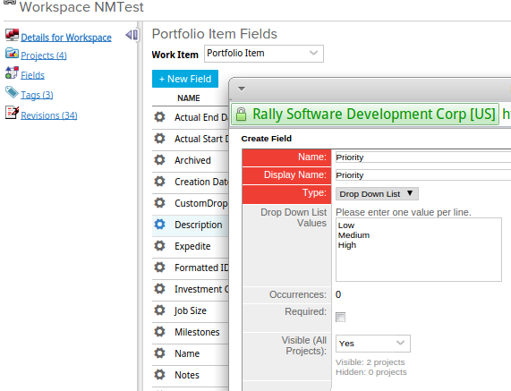

Feature Matrix
=========================

## Overview
This is a variation of [DefectSummaryMatrixApp.](https://github.com/RallyApps/app-catalog/blob/master/src/apps/defectsummarymatrix/DefectSummaryMatrixApp.js)

The code works in written for a workspace where a custom Priority field of dropdown type is added to the PortfolioItem object:

The rows are populated with summaries of Property values, and columns are populated with summaries of State values.

A click on any cell triggers creation of a grid populated with features summarized in the cell:

This app is vailable AS IS. It is NOT supported by Rally.

## License

AppTemplate is released under the MIT license.  See the file [LICENSE](./LICENSE) for the full text.

##Documentation for SDK

You can find the documentation on our help [site.](https://help.rallydev.com/apps/2.0rc3/doc/)
